# StartUp ChatBot 🚀

A Flutter-based chatbot application designed to assist entrepreneurs and students with their startup projects and final year studies. The app uses DialogFlow for natural language processing and Firebase for authentication and data storage.

## Features

- 💬 Real-time chat interface with AI-powered responses
- 🎙️ Voice input support
- 🔐 User authentication with Firebase
- 💾 Local chat history storage using SQLite
- 📱 Cross-platform support (Android, iOS, Web, Desktop)
- 🌙 Beautiful dark theme with gradient design
- 🔄 Session management for conversations

## Technologies Used

- Flutter & Dart
- Firebase (Authentication, Firestore)
- DialogFlow for NLP
- SQLite for local storage
- Provider for state management
-
. 
Various Flutter packages:
  - `flutter_chat_ui`
  - `dialog_flowtter`
  - `speech_to_text`
  - `url_launcher`
  - `animated_text_kit`

  
##screenshots

##Homepage
<p float="left">
  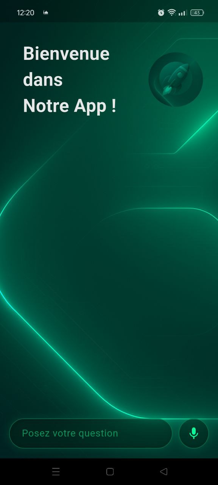
  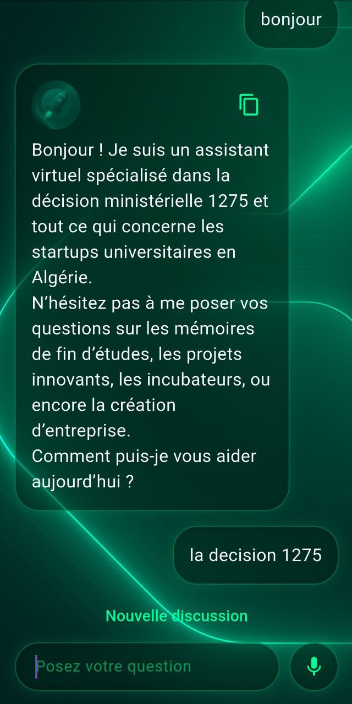
  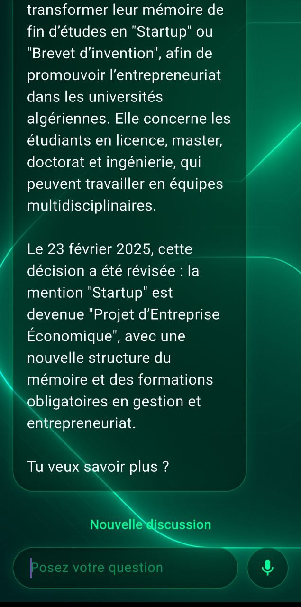
 
</p>
##Drawer
<p float="left">
  
  </p>
##Other Screens 
<p>
 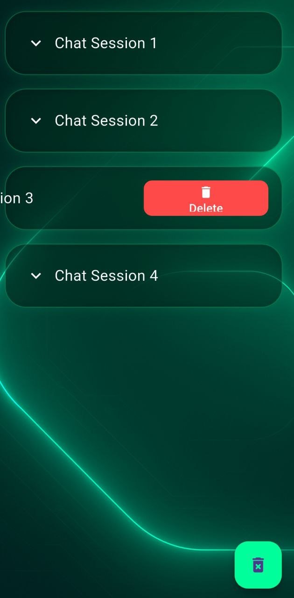
  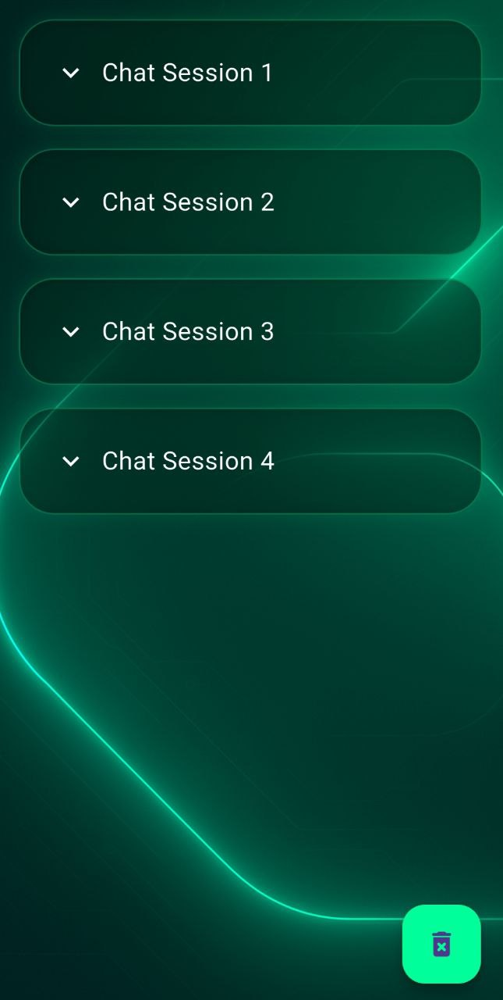
  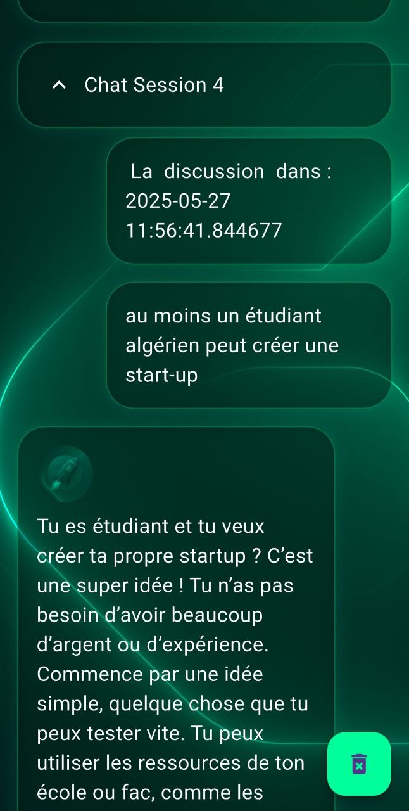
 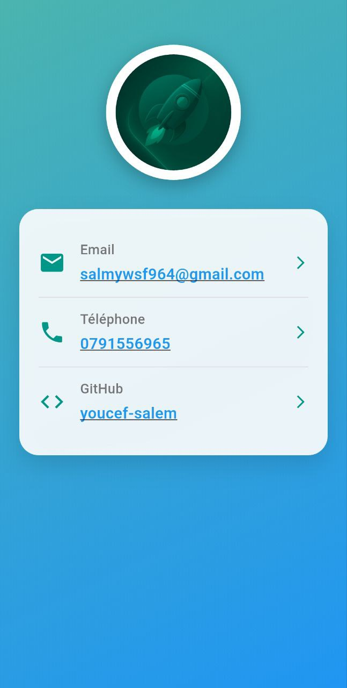
  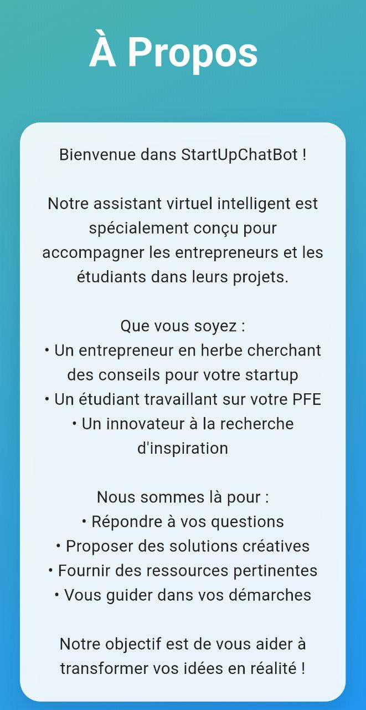
  
   
  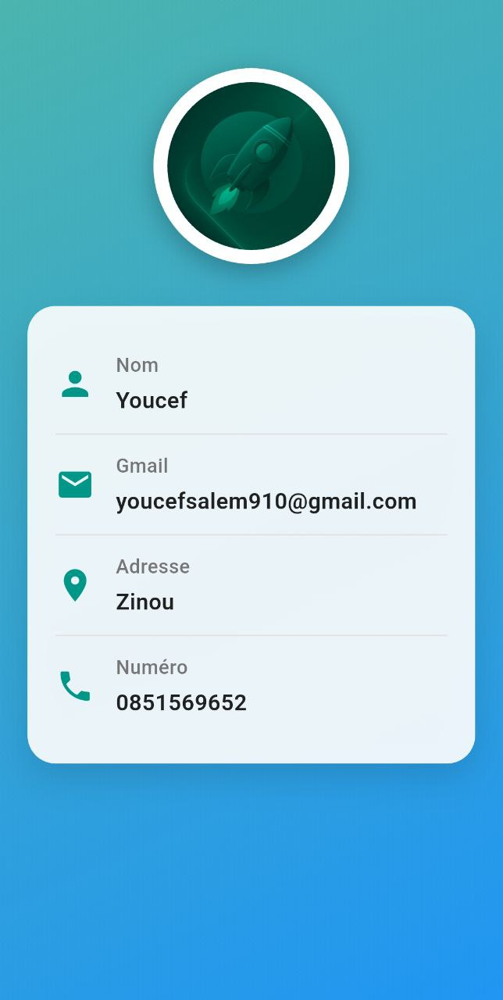
  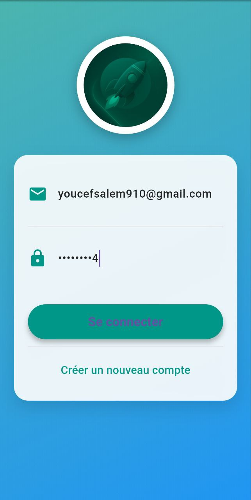
    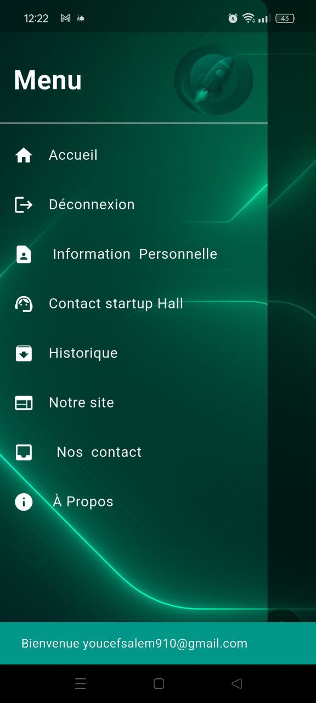

  
</p>
## Getting Started

1. Clone the repository:
```sh
git clone https://github.com/yourusername/startup_chatbot.git
